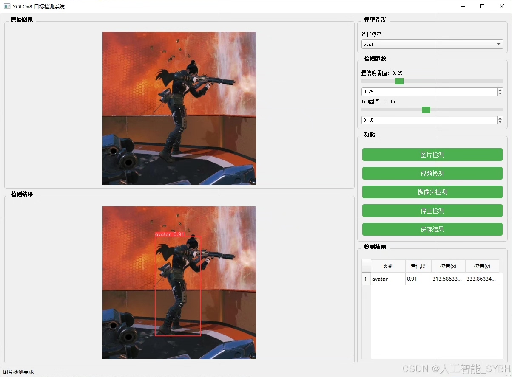
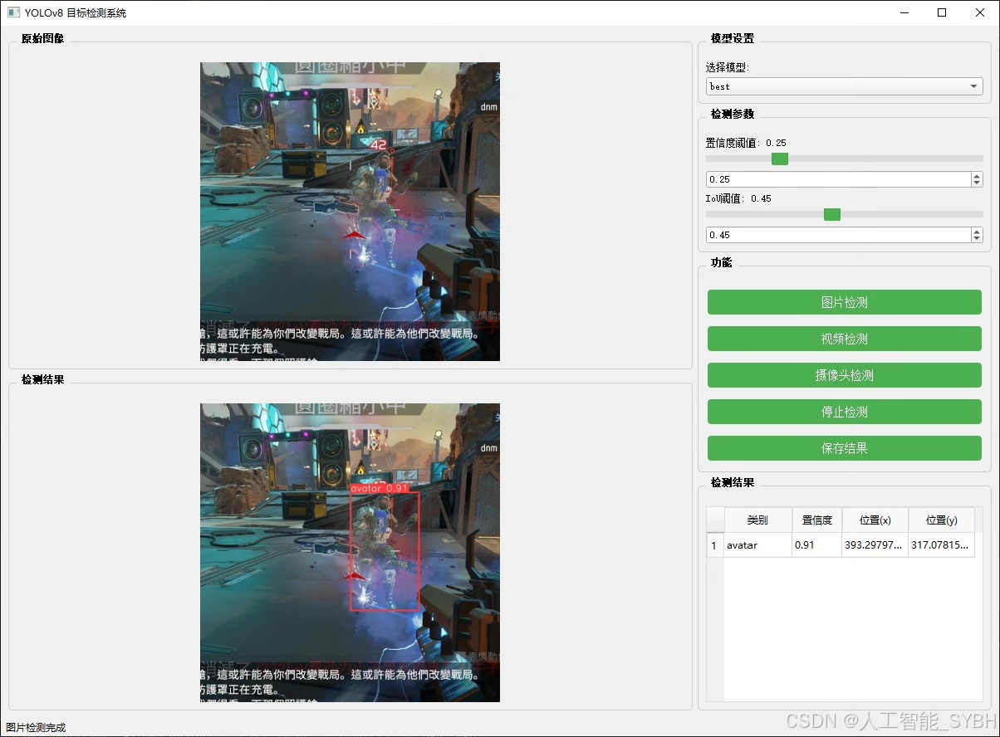
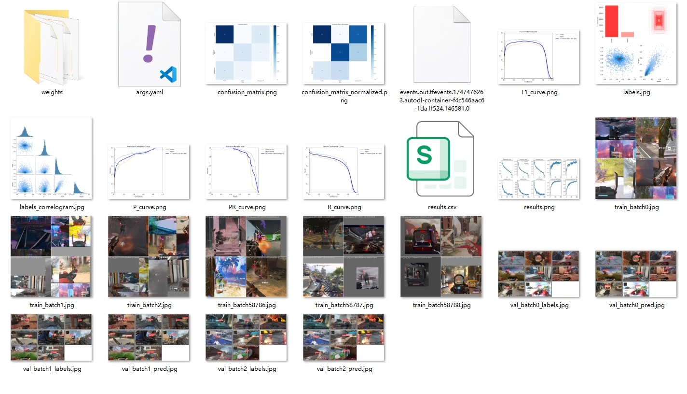
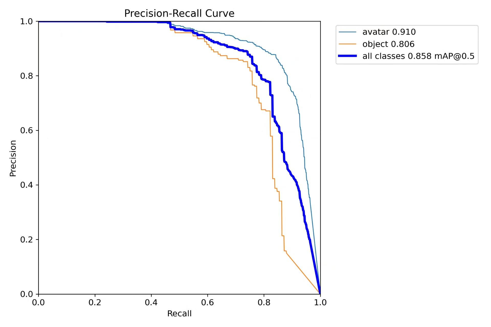
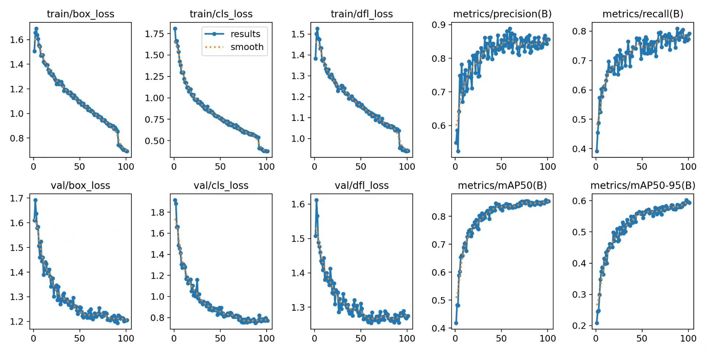
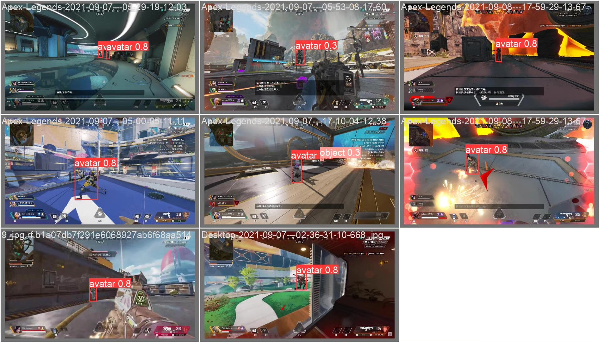
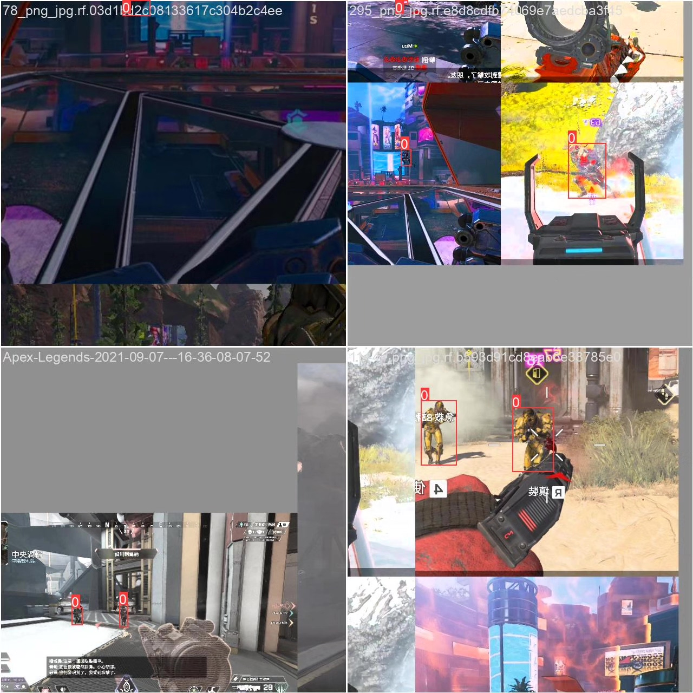
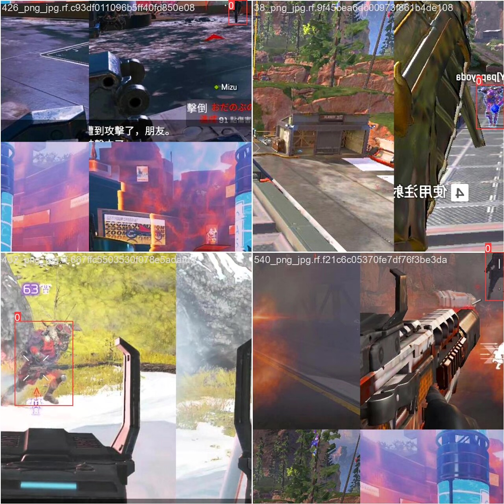

# Apex game character recognition detection system based on deep learning YOLOv8 (YO)

## Body

This project is based on the YOLOv8 object detection algorithm, developing a highly efficient and real-time Apex Legends (Apex Heroes) game character recognition detection system. It can accurately recognize two types of targets in the game scene: player characters (Avatar) and interactive objects (Object). The system utilizes deep learning technology, training and optimizing on the training set (2,583 images), validation set (691 images), and test set (415 images) to ensure that the model has high detection accuracy and generalization capabilities.

The company's products have obtained the official commercial license certification from YOLO.

We provide after-sales service.

After payment, we will provide a WeChat account for any questions you may have.

Environment configuration: We will provide an environment configuration tutorial, and WeChat will provide answers to questions.

Remote installation service: If you need remote configuration, an additional fee of 69 is required, with all fees refunded if the configuration fails (only refunding installation fees for older computers).

Retraining dataset: After setting up the environment, you can train on your own computer. If you need us to retrain, just pay 69 plus the computing power fee (2.5 yuan/hour).

Full after-sales service

## Images

## Payment

Here is a pay link on Stripe ( https://buy.stripe.com/3cs8yP7sY87d0vu9AB ). Please contact me lonlonago@foxmail.com after funding $89, and I will send you a complete data files , thank you!

